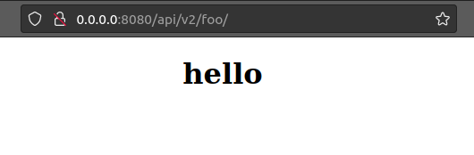
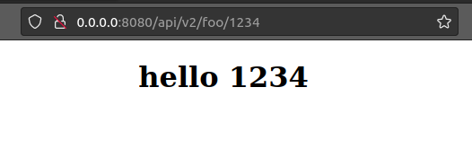

### Django function based views
- urls.py
```python
from django.urls import path

from .views import views

urlpatterns = [
    path("foo/", views.bar, name="infos"),
    path("foo/<int:pk>", views.bar, name="info-details")
]
```
- views.py
```python
from django.shortcuts import render
from strongtyping_pyoverload import overload

@overload
def bar(request):
    return render(request, "info.html", {"info_txt": "hello"})

@overload
def bar(request, pk: int):
    return render(request, "info.html", {"info_txt": f"hello {pk}"})
```


